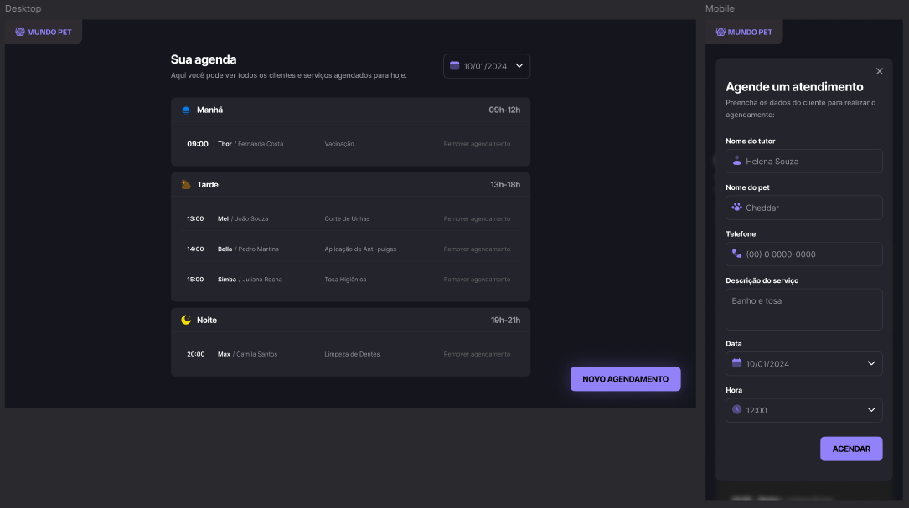

# 🚀 Agendamento pet-shop

## 📌 Descrição

Este projeto é um sistema de agendamento desenvolvido para um petshop, com foco em proporcionar uma experiência simples e funcional para gerenciamento de agendamentos de serviços.

## 🧠 Descrição Técnica

- Webpack: Utilizado para o empacotamento dos módulos JavaScript e dos arquivos de estilo, organizando e otimizando o código para execução no navegador.
- Webpack DevServer: Responsável por rodar um servidor de desenvolvimento com recarregamento automático (live reload) sempre que os arquivos forem alterados.
- JSON Server: Usado para simular uma API RESTful e permitir testes completos de funcionalidades como requisições e manipulação de dados.
- CSS Responsivo: Foram aplicadas boas práticas de CSS, com foco em responsividade para garantir que a aplicação funcione bem em diferentes tamanhos de tela.

## 💡 Funcionalidades

- Agendamento de serviços
- Listagem e visualização de agendamentos
- Visualização por data específica
- Interface amigável e responsiva

## 🛠️ Tecnologias e Conceitos Aplicados

Além de conceitos padrão de HTML e CSS:

- **JavaScript (ES6+)** – Uso de fetch para requisições à API, manipulação de DOM e lógica para tratamento dos dados.
- **Webpack** – Empacotamento dos módulos JavaScript e assets para ambiente de produção.
- **Webpack DevServer** – Servidor de desenvolvimento com live reload para facilitar os testes durante o desenvolvimento.
- **JSON Server** – Simulação de uma API RESTful com dados em server.json, permitindo testes de requisições CRUD sem necessidade de backend real.
- **Organização modular** – Separação clara dos arquivos JS, CSS e imagens dentro da pasta src.
- **Manipulação dinâmica da DOM** – Renderização de dados de forma interativa com base na resposta da API simulada.
- **Eventos e escutadores** – Para lidar com interações do usuário, como cliques e envio de formulários.
- **Boas práticas de responsividade com CSS** – Layout adaptável a diferentes tamanhos de tela usando media queries e estrutura flexível.

## 🎨 Design e Protótipo

Aqui está uma prévia do design do projeto:



## 📁 Estrutura do Projeto

```plaintext
/rs-fs-agendamento-petshop
│── /dist
│── /src
│   ├── /assets
│   ├── /libs
│   ├── /modules
│   ├── /services
│   ├── /styles
│   ├── /utils
│   ├── /main.js
│── .gitignore
│── archetype.png
│── index.html
│── package-lock.json
│── package.json
│── README.md
│── server.json
│── webpack.config.js
```

## 💻 Como executar localmente

1. **Clone o repositório:**

   ```bash
   git clone https://github.com/eomgn/rs-fs-agendamento-petshop.git
   cd rs-fs-agendamento-petshop
   ```

2. **Instale as dependências:**

   ```bash
   npm install
   ```

3. **Inicie o JSON Server para simular a API:**

   ```bash
   npm run server
   ```

   Acesse em: `http://localhost:3333/schedules`

4. **Inicie o servidor de desenvolvimento com Webpack:**

   ```bash
   npm run dev
   ```

   Acesse em: `http://localhost:3000`

## 🤝 Contribuições

Quer contribuir com este projeto? Siga estes passos:

```sh
git fork
git checkout -b minha-mudanca
git commit -m "descrição da alteração"
git push origin minha-mudanca
```

Depois, abra um **Pull Request**.

## 🛜 Social

- [Linkedin](https://www.linkedin.com/in/eomgn/)
- [GitHub](https://github.com/eomgn)
- [Rocketseat](https://app.rocketseat.com.br/me/eomgn)
- [Frontend Mentor](https://www.frontendmentor.io/profile/eomgn)

```readme
 Feito com ❤️ e atenção com propósito de aprendizagem contínua.
```
